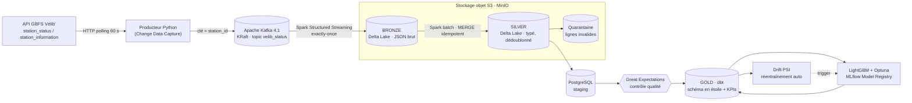

# Vélib' Data Platform : pipeline de données temps réel et MLOps

[](https://github.com/adham-marrakchi/velib-data-platform/actions/workflows/cicd-pipeline.yml)


Plateforme data **end-to-end** construite sur les **données ouvertes Vélib' Métropole** (Paris, environ 1 500 stations).
Elle couvre la chaîne complète du **data engineering** et du **MLOps** :

- **ingestion temps réel** (streaming) avec Apache Kafka ;
- **traitement** avec Spark Structured Streaming ;
- **Lakehouse Delta Lake** en **architecture médaillon** (Bronze / Silver / Gold) ;
- **modélisation dimensionnelle** avec dbt (schéma en étoile) ;
- **orchestration** avec Apache Airflow 3 ;
- **qualité des données** avec Great Expectations ;
- **machine learning** (LightGBM et Optuna, suivi dans MLflow) avec **détection de drift**.

> **Problème métier.** Une station vide ou pleine fait perdre un trajet à l'usager et coûte cher en régulation (camions de rééquilibrage).
> La plateforme mesure en continu la disponibilité de chaque station, repère les **stations critiques** et **prévoit le nombre de vélos disponibles à 1 heure**.

---

## Sommaire

- [Architecture](#architecture)
- [Fonctionnalités clés](#fonctionnalités-clés)
- [Stack technique](#stack-technique)
- [Modèle de données (Gold)](#modèle-de-données-gold)
- [Orchestration Airflow](#orchestration-airflow)
- [Machine Learning et MLOps](#machine-learning-et-mlops)
- [Démarrage rapide](#démarrage-rapide)
- [Qualité du code et CI](#qualité-du-code-et-ci)
- [Structure du dépôt](#structure-du-dépôt)
- [Feuille de route](#feuille-de-route)
- [Compétences mises en œuvre](#compétences-mises-en-œuvre)

---

## Architecture



Airflow 3 orchestre l'ensemble : planification par horaires cron et par **Assets** (planification pilotée par les données). Les métriques passent par StatsD et sont exposées à **Prometheus**.

| Couche | Technologie | Rôle |
|---|---|---|
| Ingestion | Python, `requests` (retries), Kafka producer | Interroge le flux GBFS toutes les 60 s et ne publie que les stations modifiées (CDC) |
| Messaging | Apache Kafka 4.1 (KRaft, sans ZooKeeper) | Topic partitionné par `station_id` : l'ordre des relevés est garanti par station |
| Bronze | Spark Structured Streaming → Delta Lake | Données brutes, métadonnées Kafka (offset, partition), garantie **exactly-once** via checkpoint |
| Silver | Spark batch → Delta Lake | Schéma explicite, typage, dédoublonnage, **MERGE** idempotent, quarantaine des lignes invalides |
| Qualité | Great Expectations | Suite `silver_velib_status` exécutée avant tout chargement en Gold |
| Gold | dbt + PostgreSQL | Schéma en étoile, modèles **incrémentaux**, agrégats métier, tests dbt, documentation |
| ML | LightGBM, Optuna, MLflow | Prévision à 1 h, Model Registry, alias « champion », drift PSI |
| Observabilité | StatsD exporter, Prometheus, callbacks Airflow | Fraîcheur des données, lag Kafka, débit des micro-batchs, alertes sur échec |

---

## Fonctionnalités clés

- **Streaming temps réel exactly-once.** Les offsets Kafka sont mémorisés dans le checkpoint Spark et le sink Delta est transactionnel. Après un crash, le job reprend sans doublon ni perte.
- **Change Data Capture côté producteur.** Une station n'est republiée que si son `last_reported` a changé, ce qui réduit fortement le volume sans perdre d'information.
- **Architecture médaillon et Lakehouse.**
  - *Bronze* : brut, rejouable.
  - *Silver* : nettoyé, typé, dédoublonné.
  - *Gold* : modèle analytique.
  - Silver se recalcule toujours depuis Bronze (**idempotence** et **rejouabilité**).
- **Maintenance du Delta Lake.** `OPTIMIZE` compacte les petits fichiers produits par le streaming, `VACUUM` purge les anciennes versions. Un DAG les lance chaque nuit.
- **Data Quality.** Les lignes invalides partent en **quarantaine** avec leur motif. Great Expectations bloque la promotion vers Gold si une attente échoue. Les tests dbt complètent le dispositif (`not_null`, `unique`, `relationships`, `accepted_values`, `dbt_utils`, tests génériques maison).
- **Data Observability.** Un DAG de **fraîcheur des données** (toutes les 5 min) vérifie l'activité du pipeline. Des alertes `on_failure_callback` partent sur échec, avec retries et backoff exponentiel. Prometheus collecte les métriques.
- **MLOps de bout en bout.** Entraînement hebdomadaire, prédictions déclenchées par l'Asset Gold, **détection de data drift (PSI)** quotidienne et **réentraînement automatique** si le drift dépasse le seuil.

---

## Stack technique

**Langages** : Python, SQL, Bash
**Data Engineering** : Apache Kafka (KRaft), Apache Spark / PySpark (Structured Streaming et batch), Delta Lake, dbt, PostgreSQL, MinIO (stockage objet compatible S3)
**Orchestration** : Apache Airflow 3 (DAGs, Assets, TriggerDagRunOperator, callbacks)
**Qualité des données** : Great Expectations, tests dbt, quarantaine
**Machine Learning / MLOps** : LightGBM, scikit-learn, Optuna, MLflow (Tracking et Model Registry), pandas, NumPy
**DevOps** : Docker, Docker Compose, GitHub Actions (CI), Makefile, pytest, flake8, black, isort
**Monitoring** : Prometheus, StatsD

---

## Modèle de données (Gold)

Modélisation dimensionnelle en **schéma en étoile** avec dbt (`staging` → `intermediate` → `marts`) :

| Modèle | Type | Description |
|---|---|---|
| `fact_disponibilite` | Table de faits (incrémentale) | Relevés de disponibilité : vélos mécaniques, électriques, bornes libres |
| `fct_station_horaire` | Table de faits (incrémentale) | Agrégat horaire par station, socle des features ML |
| `dim_station` | Dimension | Référentiel des stations (nom, capacité, coordonnées) |
| `dim_date`, `dim_heure` | Dimensions | Calendrier (jours fériés) et tranches horaires |
| `agg_stations_critiques` | KPI | Temps passé vide / pleine par station, classement pour la BI |
| `agg_remplissage_horaire` | KPI | Profil de remplissage moyen par heure |
| `agg_disponibilite_zone_horaire` | KPI | Disponibilité par zone géographique et par heure |
| `etat_actuel_stations` | Vue opérationnelle | Dernier état connu de chaque station |
| `ml_predictions_vs_reel` | Suivi ML | Prédictions comparées à la réalité observée |

Les **exposures dbt** documentent qui consomme quels modèles. Un rôle PostgreSQL **en lecture seule** sur Gold (`gold_reader`) sert aux usages BI.

---

## Orchestration Airflow

| DAG | Planification | Rôle |
|---|---|---|
| `velib_stations_reference_dag` | quotidien 03:00 | Charge le référentiel des stations (`station_information`) |
| `velib_silver_quality_dag` | toutes les 15 min | Job Spark Silver → contrôle Great Expectations → staging |
| `dbt_gold_dag` | horaire | Fraîcheur des sources, `dbt seed`, `run`, `test`, `docs` |
| `data_freshness_dag` | toutes les 5 min | Alerte si les données ne sont plus à jour |
| `lake_maintenance_dag` | quotidien 02:30 | `OPTIMIZE` et `VACUUM` des tables Delta |
| `ml_training_dag` | hebdomadaire | Entraînement LightGBM + Optuna, enregistrement MLflow |
| `ml_prediction_dag` | sur l'Asset Gold | Prédictions à 1 h écrites dans l'entrepôt |
| `drift_monitoring_dag` | quotidien 06:00 | Calcul du PSI, déclenche `ml_training_dag` en cas de drift |

Les dépendances entre DAGs passent par des **Assets Airflow 3** : le DAG de prédiction démarre dès que Gold est mis à jour, sans horaire fixe. dbt et le pipeline Spark/ML tournent dans des **environnements virtuels isolés** à l'intérieur de l'image Airflow.

---

## Machine Learning et MLOps

- **Cible** : nombre de vélos disponibles par station **dans 1 heure** (régression sur séries temporelles).
- **Features** : décalages temporels (lags), heure, jour de la semaine, **jours fériés** (`holidays`), caractéristiques de la station.
- **Validation temporelle** : le jeu de test est toujours la période la plus récente, sans fuite de données (data leakage).
- **Baseline** : un modèle naïf de persistance (« dans 1 h, comme maintenant »), que LightGBM doit battre.
- **Optimisation des hyperparamètres** avec **Optuna**, elle aussi sur une validation temporelle.
- **MLflow** : suivi des paramètres et des métriques (MAE, RMSE), **Model Registry**, promotion automatique sous l'alias `champion` seulement si le nouveau modèle fait au moins aussi bien que le champion **sur le même jeu de test**.
- **Monitoring du modèle** :
  - **PSI (Population Stability Index)** entre les features récentes et celles de l'entraînement : en dessous de 0,1 le modèle est stable, au-dessus de 0,2 il est réentraîné ;
  - comparaison des prédictions avec la réalité dans `ml_predictions_vs_reel`.

---

## Démarrage rapide

**Prérequis** : Docker et Docker Compose, environ 8 Go de RAM alloués à Docker, `make` (facultatif).

```bash
git clone https://github.com/adham-marrakchi/velib-data-platform.git
cd velib-data-platform
cp .env.example .env      # adapter les mots de passe si besoin
make build                # ou : docker compose build
make up                   # ou : docker compose up -d
make urls                 # liste des interfaces
```

| Interface | URL |
|---|---|
| Airflow | http://localhost:8080 |
| Spark Master | http://localhost:8081 |
| Spark Streaming UI | http://localhost:4040 |
| MinIO Console | http://localhost:9001 |
| MLflow | http://localhost:5001 |

Le producteur se met à publier dès le démarrage. Une fois les DAGs activés dans Airflow, les couches Silver puis Gold se remplissent.

---

## Qualité du code et CI

```bash
make test     # tests unitaires pytest
make lint     # flake8 + black + isort
```

Le pipeline **GitHub Actions** exécute à chaque push :

- le lint (flake8, black, isort) ;
- les tests unitaires avec couverture : producteur Kafka, calcul du PSI, structure du projet, configuration Docker Compose ;
- la validation de `docker-compose.yaml` ;
- le build des images Docker.

---

## Structure du dépôt

```
├── kafka/               # Producteur GBFS → Kafka (CDC, retries, métriques)
├── spark/               # Jobs Bronze (streaming) et Silver (batch, MERGE, maintenance)
├── quality/             # Validation Great Expectations de la couche Silver
├── great_expectations/  # Suites d'attentes
├── dbt/velib/           # Modèles staging / intermediate / marts, tests, exposures
├── airflow/             # Image Airflow 3 + DAGs (ingestion, qualité, dbt, ML, maintenance)
├── ml/                  # Features, entraînement, prédiction, drift PSI
├── mlflow/              # Image du serveur MLflow
├── monitoring/          # Configuration Prometheus / StatsD
├── scripts/postgres/    # Initialisation de l'entrepôt (schémas, rôles)
├── tests/               # Tests unitaires pytest
├── docker-compose.yaml  # Stack locale complète
└── Makefile
```

---

## Feuille de route

- [x] Ingestion temps réel Kafka (KRaft) depuis l'API GBFS Vélib'
- [x] Lakehouse Delta Lake Bronze / Silver avec garantie exactly-once
- [x] Qualité des données : Great Expectations, quarantaine, tests dbt
- [x] Modèle Gold en étoile avec dbt
- [x] Orchestration Airflow 3 par Assets
- [x] ML : LightGBM, Optuna, MLflow Model Registry, drift PSI, réentraînement automatique
- [ ] Dashboards BI (Grafana / Superset)
- [ ] Assistant analytique en langage naturel (LLM local, text-to-SQL sur Gold)
- [ ] Déploiement cloud AWS : **Terraform** (S3, RDS, EKS) et **Kubernetes / Helm**
- [ ] Data catalog et lineage

---

## Compétences mises en œuvre

`Data Engineering` · `Pipeline ETL / ELT` · `Streaming temps réel` · `Apache Kafka` · `Spark Structured Streaming` · `PySpark` · `Delta Lake` · `Lakehouse` · `Architecture médaillon` · `dbt` · `Modélisation dimensionnelle` · `Schéma en étoile` · `SQL` · `PostgreSQL` · `Data Warehouse` · `Apache Airflow` · `Orchestration` · `Data Quality` · `Great Expectations` · `Data Observability` · `Change Data Capture` · `Idempotence` · `Exactly-once` · `Machine Learning` · `MLOps` · `MLflow` · `LightGBM` · `Optuna` · `Séries temporelles` · `Feature Engineering` · `Data Drift` · `Docker` · `Docker Compose` · `CI/CD` · `GitHub Actions` · `pytest` · `Prometheus` · `Stockage objet S3` · `Open Data`

---

## Auteur et crédits

Projet réalisé par [@adham-marrakchi](https://github.com/adham-marrakchi).

Le squelette initial (Docker Compose, Makefile, CI) vient du projet open source
[hoangsonww/End-to-End-Data-Pipeline](https://github.com/hoangsonww/End-to-End-Data-Pipeline) (licence MIT).
Le pipeline a été entièrement réécrit autour du cas d'usage Vélib' : ingestion, couches Delta, dbt, DAGs, ML et tests.
Les données proviennent de l'[open data Vélib' Métropole](https://www.velib-metropole.fr/donnees-open-data-gbfs-du-service-velib-metropole).
